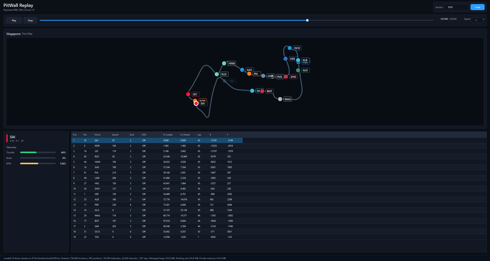

# PitWall


PitWall is a work-in-progress Windows desktop application that turns [OpenF1](https://openf1.org/docs/) session data into an interactive Formula 1 replay.

Load a session, move through its timeline, follow the cars on the circuit map, and inspect timing and telemetry for each driver.



## Getting started

### Requirements

- Windows x64
- An internet connection
  
PitWall uses OpenF1's free access meaning it cannot load data while an F1 session is live, even if you select an older session. Wait until the live session has ended and OpenF1 has made the data public before loading a replay.

### Option 1: Download a release

Download the latest Windows build from the [Releases](https://github.com/DuckMeMz/PitWall/releases) page.

### Option 2: Run from source

You'll need [.NET 10 SDK](https://dotnet.microsoft.com/download/dotnet/10.0) 

```powershell
git clone https://github.com/DuckMeMz/PitWall.git
cd PitWall
dotnet restore
dotnet run --project PitWall/PitWall.csproj
```

## Load a replay

1. You can use the session finder to easily search race weekends. Alternatively, you can use `latest` or an OpenF1 `session key` to manually search for races. (Some session keys suggestions below)
2. Select **Load** and wait for the session data to be processed. See [current limitations](#current-limitations).
3. Use the playback controls and timeline to explore the session.
4. Select a driver in the timing table to focus their marker and telemetry.

### Sessions to try

| Session key | Session | Why explore it? |
| --- | --- | --- |
| `latest` | Latest available OpenF1 session | See whichever practice, qualifying, sprint, or race session OpenF1 currently returns. |
| `9636` | [2024 São Paulo Grand Prix](https://www.formula1.com/en/latest/article/verstappen-wins-chaotic-sao-paulo-grand-prix-after-stunning-recovery-from.1DIc8pzRmGbC3jHJmvtBi1) | Verstappen's recovery from P17 to pole and an Alpine double podium. |
| `9165` | [2023 Singapore Grand Prix](https://www.formula1.com/en/latest/article/sainz-holds-off-norris-and-fast-charging-mercedes-pair-to-take-sensational.16sNsRUz2MAFyXxSE3RdwX) | Sainz using Norris's DRS to defend from both Mercedes. |
| `9507` | [2024 Miami Grand Prix](https://www.formula1.com/en/latest/article/norris-beats-verstappen-for-breakthrough-maiden-f1-victory-in-action-packed.7f9W6X9L3kPQILyO3NljL1) | Lando Norris's first Formula 1 victory. |
| `9558` | [2024 British Grand Prix](https://www.formula1.com/en/latest/article/hamilton-beats-verstappen-to-first-win-since-2021-with-record-breaking-9th.3teU9bznaWJlC2TGAYh0Vl.3teU9bznaWJlC2TGAYh0Vl) | Lewis Hamilton's ninth British Grand Prix win. |


## Current limitations

- A session is downloaded and held in memory before playback begins, so large sessions can take time to load (up to around 80 seconds)
- There is no local cache yet; loading the same session repeats the API requests.
- Driver location may be inaccurate; depends on the completeness and timing of the source data.
- A session displays all of the data including before and after the race, where many cars may be stationary.
- The interface is still early in design.

## Roadmap

- [ ] Add buffered and chunked loading to reduce startup time and memory usage.
- [ ] Add a SQLite cache for downloaded session data.
- [x] Build a session finder so users can browse events instead of looking up session keys.
- [ ] Display race-control messages on the replay timeline.
- [ ] Add synchronised team-radio playback.
- [ ] Create a custom graph data section, so users can combine and view chosen data.
- [ ] Continue improving the UI, loading feedback, and error handling.
